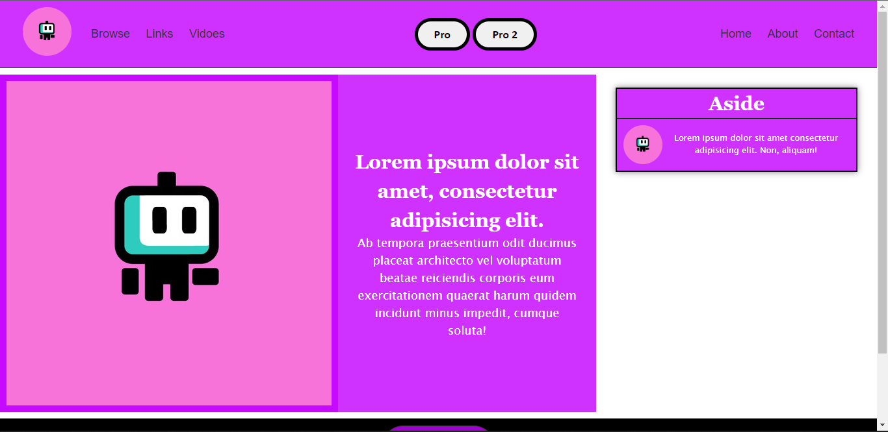
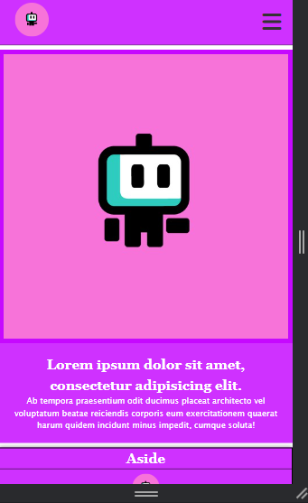
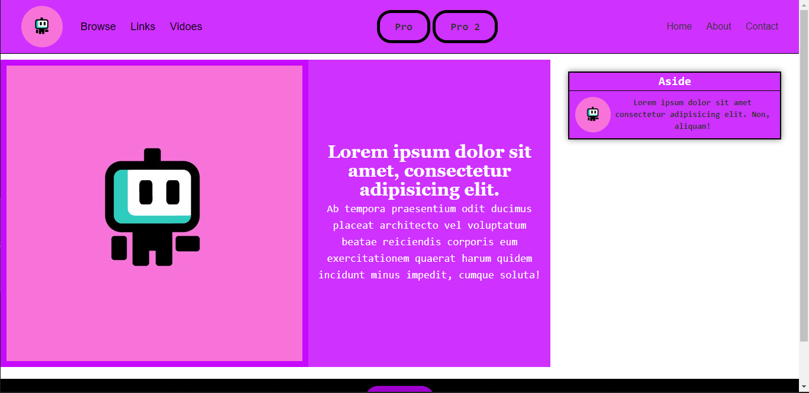
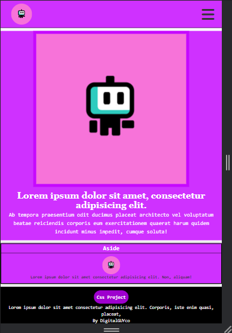

## Built a simple project with plain css and with Tailwind CSS

#### a simple project that helped to learn flexbox and also twailwind css

#### Snapshots

### With plain css

### With tailwind css

